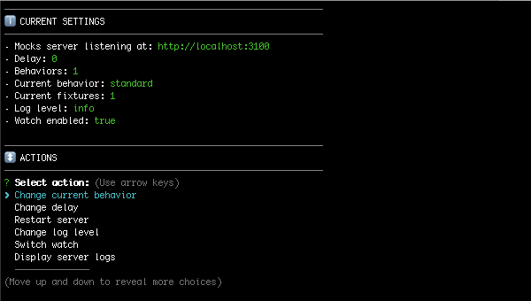

## Preface

As mentioned, fixtures and behaviors can be also defined using javascript, which gives the possibility of reuse portions of them, or even create them programmatically.

In this chapter we are going to repeat the same steps than in the ["Defining fixtures and behaviors"](guides-defining-fixtures.md) guide, but now we are going to create all using javascript instead of `json` files.

> Remember that you can combine `json` definitions with `javascript` definitions at your convenience in the `mocks` folder.

## Files structure

Create a `/mocks` folder in your project root, containing a `behaviors.js` file, and a `fixtures/users.js` file:

```
/your/awesome/project
|-- node_modules
|-- src
|-- mocks
|   |-- behaviors.js
|   |-- fixtures
|   |   |-- users.js
|-- package.json
```

> Each file will export many fixtures and behaviors. Read more about the [exportation of fixtures and behaviors in javascript here](guides-organizing-the-definitions.md).

## Create an users fixture

Now we are going to add a fixture to the `/mocks/fixtures/users.js` file, which will be used when GET requests are received in the `/api/users` path or our "api mock":

```javascript
//mocks/fixtures/users.js

const getUsers = {
  id: "get-users",
  url: "/api/users",
  method: "GET",
  response: {
    status: 200,
    body: [
      {
        id: 1,
        name: "John Doe"
      },
      {
        id: 2,
        name: "Jane Doe"
      }
    ]
  }
};

module.exports = {
  getUsers
};
```

## Export a default behavior

Import your recently created `getUsers` fixture in the `/mocks/behaviors.js` file and create an "standard" behavior containing it. Read more about [how behaviors are defined using javascript here](get-started-behaviors.md).

```javascript
//mocks/behaviors.js

const { Behavior } = require("@mocks-server/main");

const { getUsers } = require("./fixtures/users");

module.exports = new Behavior([
  getUsers
], {
  id: "standard"
});
```

## Start the Mocks Server

```bash
npm run mocks-server
```

The interactive CLI will be started:



Browse to [http://localhost:3100/api/users](http://localhost:3100/api/users) to check that Mocks Server is serving your users collection fixture at the expected url. You should see the response in your browser:

```json
[{"id":1,"name":"John Doe"},{"id":2,"name":"Jane Doe"}]
```

## Add fixture for getting an specific user

Now we have the mocked the response for the "users" collection. Let's add the fixture for getting an specific user:

```javascript
//mocks/fixtures/users.js

//...

const getUser = {
  id: "get-user",
  url: "/api/users/:id",
  method: "GET",
  response: {
    status: 200,
    body: {
      id: 1,
      name: "John Doe"
    }
  }
}

module.exports = {
  getUsers,
  getUser
};
```

Add the fixture to the "standard" behavior. Now we will __use the id of the fixture as a reference__ instead of providing directly the fixture object itself, which is also supported:

```javascript
//mocks/behaviors.js

const { Behavior } = require("@mocks-server/main");

const { getUsers } = require("./fixtures/users");

module.exports = new Behavior([
  getUsers,
  "get-user"
], {
  id: "standard"
});
```

> The Mocks Server is watching for file changes, so your fixtures should have been refreshed automatically.

Browse to [http://localhost:3100/api/users/1](http://localhost:3100/api/users/1). You should see the response in your browser:

```json
{"id":1,"name":"John Doe"}
```

But... even when you change the user id in the request, ([http://localhost:3100/api/users/2](http://localhost:3100/api/users/2)) obviously the response will be still the same:

```json
{"id":1,"name":"John Doe"}
```

Well, this is the expected behavior of a mock server, but you can add a new "behavior" to change the response:

## Add another behavior

Let's add another "GET user" fixture, but now it will be always responded with the second user:

```javascript
//mocks/fixtures/users.js

//....

const getUser2 = {
  id: "get-user-2",
  url: "/api/users/:id",
  method: "GET",
  response: {
    status: 200,
    body: {
      id: 2,
      name: "Jane Doe"
    }
  }
}

module.exports = {
  getUsers,
  getUser,
  getUser2
};
```

And let's add a new Behavior extending the standard one:

```javascript
//mocks/behaviors.js

const { Behavior } = require("@mocks-server/main");

const { getUsers, getUser2 } = require("./fixtures/users");

const standard = new Behavior([
  getUsers,
  "get-user"
], {
  id: "standard"
});

// Extends the standard behavior adding "getUser2" fixture.
const user2 = standard.extend([ getUser2 ], {
  id: "user2"
});

module.exports = [ standard, user2 ];
```

Now the Mocks Server CLI indicates that it has two behaviors available.


## Change current behavior

Use the CLI to change current behavior:


Browse to [http://localhost:3100/api/users/2](http://localhost:3100/api/users/2). You should now see the second user:

```json
{"id":2,"name":"Jane Doe"}
```

Browse to [http://localhost:3100/api/users](http://localhost:3100/api/users). Users collection is also available:

```json
[{"id":1,"name":"John Doe"},{"id":2,"name":"Jane Doe"}]
```
