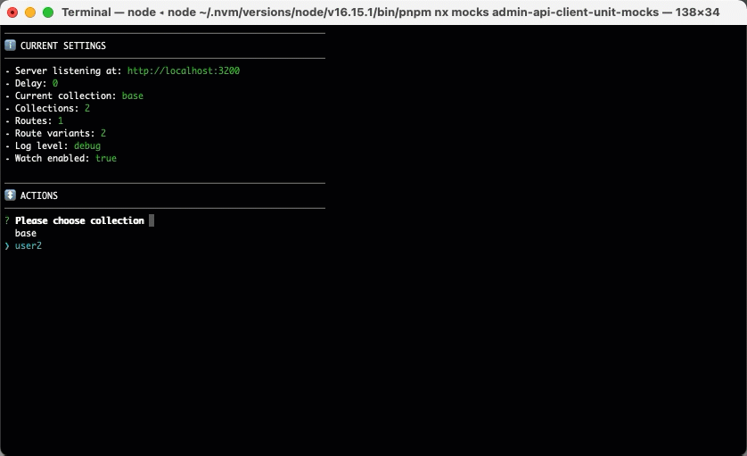

## Preface

The [Mocks Server main distribution](https://github.com/mocks-server/main/tree/master/packages/main) includes the [inquirer-cli plugin](https://github.com/mocks-server/main/tree/master/packages/plugin-inquirer-cli) preinstalled. It provides an interactive command line interface that enables to control the server using the keyboard while it is running.

Using the arrow keys and the `Return` key you can choose menu options in order to perform some actions, like changing the current collection, setting a delay time for the server responses, etc.



This CLI is a great tool for controlling the mock server while you are developing an API client, because you can change the server responses in real time using it without modifying any code. Suppose that you are developing a web application that is polling to the API, and you want to check if it is refreshing the data properly. The only thing that you have to do is to use the CLI to change the current responses collection, and the next time the application requests a data, the response will be different.

:::tip
The [interactive CLI can be disabled using configuration](#how-to-disable-it), and then the server logs will be displayed instead. This should be done when using the server for running tests, for example.
:::

## Alerts

The plugin will display Mocks Server alerts on the top of the screen. This is very useful when you are modifying [`routes`](../usage/routes.md), [`variants`](../usage/variants.md) or [`collections`](../usage/collections.md) files and any file contains an error, for example.


:::info
As Mocks Server includes hot reloading, the alert will automatically disappear when the error is fixed.
:::

## Options

* __`plugins.inquirerCli.enabled`__ _(Boolean)_: Start the interactive CLI or not. Default is `true`.
* __`plugins.inquirerCli.emojis`__ _(Boolean)_: Defines whether the inquirer CLI uses emojis or not. Default is `true`.

:::tip
[Check out the configuration docs for further info about how to change settings](../configuration/how-to-change-settings.md).
:::

## How to disable it

The interactive CLI can be disabled using configuration. The server logs will be displayed instead. This is useful when running tests on CI, for example.

```sh
npm run mocks -- --no-plugins.inquirerCli.enabled
```

## Support

The [Inquirer library](https://www.npmjs.com/package/inquirer) is used for displaying the interactive CLI. You can [consult its OS Terminals support here](https://www.npmjs.com/package/inquirer#support-os-terminals).
